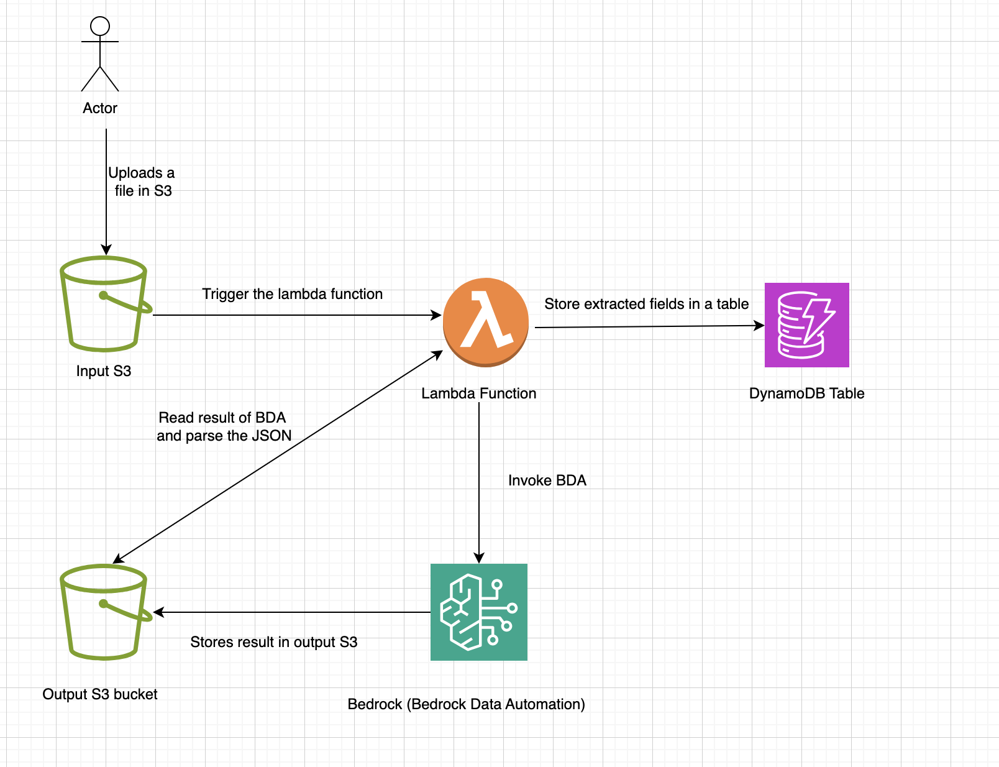

This CDK uses S3, Lambda, Bedrock and DynamoDB to showcase how we can use bedrock data automation to extract information from any kind of documents

Pre-requisites:

1. Python3 is installed on your system
2. virtualenv library is installed (run the command `pip install virtualenv`)
3. Docker is installed and running on your machine
4. AWS CLI installed and setup (make sure you have generated the secret credentials from AWS IAM and set the coorect region in aws cli)

To deploy this construct follow the steps below:

1. Create a new folder and then create a virtual env using the command
    `virtualenv venv`
2. Activate the virtual env from command line
3. From the root directory of this project run the following command to install all cdk python libraries:
    `pip install -r requirements.txt`
4. Run the following command to make sure our environment is bootstrapped:
    `cdk bootstrap`
5. Run the following command to authenticate in Public ECR then only it will be able to download python public image for ECR:
    `aws ecr-public get-login-password --region <region-name> | docker login --username AWS --password-stdin public.ecr.aws`
Replace the `<region-name>` with the actual region name
6. Run the following command to make sure the CDK code is synthesized:
    `cdk synth`
7. Run the following command that will deploy the application:
    `cdk deploy`
8. After the successful deployment we can use test the CDK deployment

To test this deployment follow the steps below:

1. Go to the `S3` service and find the s3 bucket that was created as a part of this deployment 
2. Upload the `sample_image_w2.jpeg` file which is present in the root direcotry of this CDK folder
3. This will trigger the lambda function and using the `Bedrock Data Automation` it is going to extract the two fields `ssn_number` and `wages_and_compensation` fields from this document and store it in the dynamoDB table
4. After some time, you can go in the DynamoDB service in AWS console and find the table created as a part of this CDK deployment
5. Click on `Explore items` button and you would see the extarcted information
6. You can download the detailed output from the S3 bucket

In the above architecture diagram:

1. A user uploads files or file, each file upload is going to trigger one lambda function
2. This lambda function is going to use bedrock data automation and extarct the fields from the documents
3. Then it is going to store the information in a dynamodb table

To cutomize:

You can customize the lambda code in `lambda/lambda_function.py` file and perfrom any kind of bedrock data automation feature using boto3 library. you can find more linformation here: [Documentation](https://boto3.amazonaws.com/v1/documentation/api/latest/reference/services/bedrock-data-automation-runtime.html#RuntimeforBedrockDataAutomation.Client)

In this lambda function:
1. You can modify `schema` variable's `properties` and specify any kinf of properties you want to extarct from documents
2. The `description` variable for each property or filed you can specify a simple prompt like what you want to extact
3. Then, this lambda function is creating a blueprint of this schema and extarct from the documents. For demo purpose, I am generating a new uuid for each time you run the lambda function for blueprint. But, you can handle the logic if a blueprint is already created then, no need to create it again and maintain blueprints
4. Then from the output s3 bucket I am getting the JSON output files and parsing those and then stroing the extarcted information in a DynamoDB table

Note: the lambda function here just for demo purposes, you can do many many more things using bedrock data automation and you can build your application specific code by looking into the documentation. 

You can see a small demos of bedorck data automation here: 
1. [Demo 1](https://drive.google.com/file/d/1NTw1iV6mK1W7YfKsoNh6Nxe0ozAThO4A/view?usp=sharing)
2. [Demo 2](https://drive.google.com/file/d/1rdlpOkRnoDJ3vHuBtjQe2AZ3F0HgJ9Da/view?usp=sharing)

