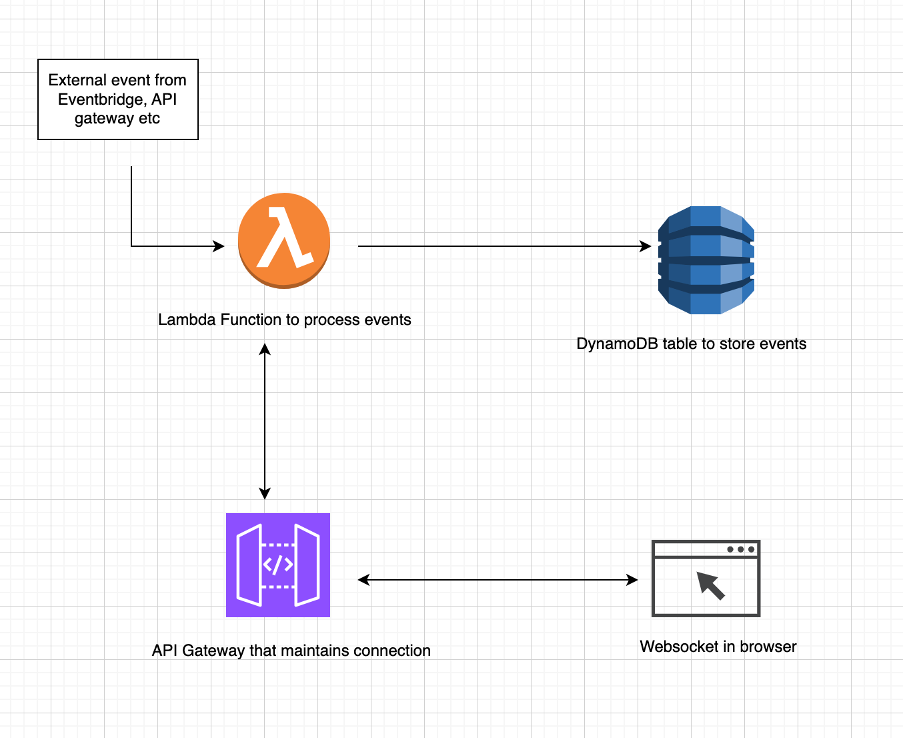

This is a CDK construct that uses lamdba function, API Gateway and DynamoDB table to send notifications from backend to frontend asynchronously.

Pre-requisites:
1. Python3 is installed on your system
2. virtualenv library is installed (run the command `pip install virtualenv`)
3. Docker is installed and running on your machine
4. AWS CLI installed and setup (make sure you have generated the secret credentials from AWS IAM and set the coorect region in aws cli)

To use deploy the CDK code follow the below steps:

1. Create a new folder and then create a virtual env using the command
    `virtualenv venv`
2. Activate the virtual env from command line
3. From the root directory of this project run the following command to install all cdk python libraries:
    `pip install -r requirements.txt`
4. Run the following command to make sure our environment is bootstrapped:
    `cdk bootstrap`
5. Run the following command to authenticate in Public ECR then only it will be able to download python public image for ECR:
    `aws ecr-public get-login-password --region <region-name> | docker login --username AWS --password-stdin public.ecr.aws`
Replace the `<region-name>` with the actual region name
6. Run the following command to make sure the CDK code is synthesized:
    `cdk synth`
7. Run the following command that will deploy the application:
    `cdk deploy`
8. After the successful deployment we can use test the CDK deployment

To test and see if everything is working correctly follow the below steps:

1. Go the AWS console and go into the API Gateway Service, there you will see the API named `Pushback Lambda WebSocket API` click on that.
2. click on the `stages` on left panel and from there copy the `WebSocket URL` 
3. No in the root directory of the CDK project open the `sample_construct.html` and replace the `wsUrl` variable with the WeSocket URL you copied and run the HTML file
4. Now click on the connect websocket button in the webpage which will open a websocket connection (a automatic connectionId will be generated and stored in the dynamoDB table which you need to copy, for that go to the dynamodb services and click on the table that was created as part of this cdk deployment)
5. Now to simulate the pushback notifications from the backend lambda function, go to the lambda serives on console and open the lambda function that was created as part of this cdk deployment
6. Go to the `Test` section and then replce the JSON code in the `Event JSON` section with the follwing:
   `{"connectionId": "<connectionId>"
}`
Make sure you replace the <connectionId> with the connectionId you copied from dynamodb in step 4
7. Now click on Run which will send a Hello messhe to the frontend (check in the console of that html page)

The above architecture diagram show how the over all flow works
1. The websocket browser client initiates a websocket connection with API gateway which will generate a connectionId and lambda function will store and maintain that id in the dynamoDB table as long as client is connected (After disconnection that connectionId will be deleted automatically)
2. Now when some external event triggers the lamdba function it will send the event to the frontend socket through API Gateway (if the websocket is disconnected then it will throw `GoneException`)

In this Architecture Diagram, you can configure how the lambda function is triggered. In the above demo it was triggered manually from AWs console but it can be triggered by any external event source (Eventbrige, Inovation from API gateway etc). But then you need to modify the code in the lambda function to handle the event struture accordingly because every event source might have different strucutre dependiing upon source.

You can also customize what information is sotred in dynamoDB table, for now its only `connectionId` but it can contain other information like who the client is, department of client or anything which want to use in your application.

Finally, the websocket client is only a sample code, you can modify that to include authentication with appropriate clients or anything you want.
